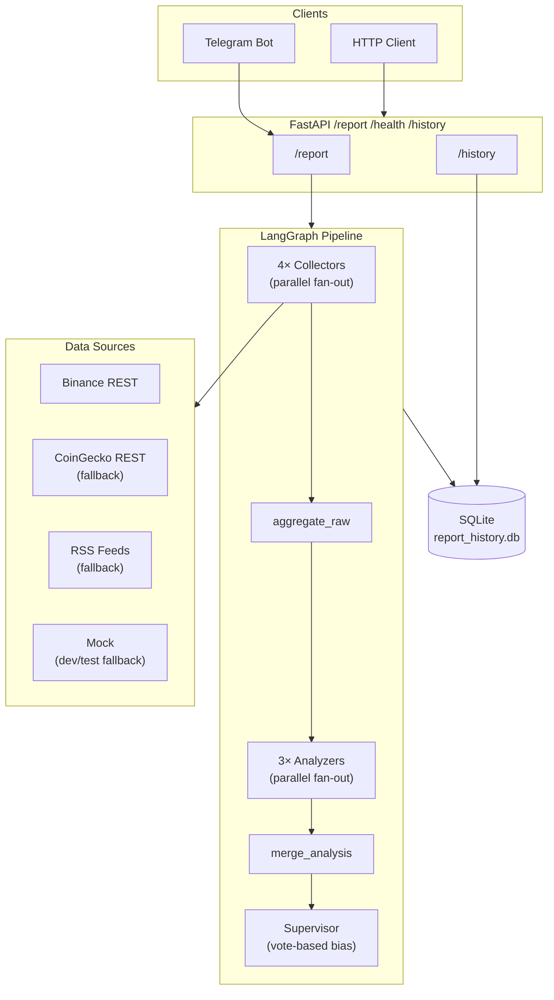

# Crypto Market Intelligence Agent

A zero-cost, demo ready multi-agent system that generates structured cryptocurrency market intelligence reports using a LangGraph pipeline, FastAPI, and a Telegram bot — with no paid API required in mock mode.

---

## Key Features

- **Multi-agent LangGraph pipeline** — four parallel collectors, three parallel analyzers, and a deterministic supervisor produce a structured `IntelligenceReport` in a single invocation
- **ICT/Smart Money Concepts market structure** — swing high/low detection, liquidity sweeps, order blocks, BOS/CHOCH classification, and RSI/MACD/momentum confluence
- **Two-tier data sources** — Binance public REST (primary) → CoinGecko public REST (fallback) → Mock (dev/test). No API keys needed.
- **RSS news adapter** — fetches from CoinTelegraph, CoinDesk, Decrypt; filters by coin keyword relevance
- **FastAPI REST API** — `/health`, `/report`, `/history` with optional X-API-Key auth
- **Telegram bot** — `/report BTCUSDT` command with HTML-formatted output
- **SQLite report history** — auto-pruned to 100 rows per symbol, with `GET /history`
- **Risk consistency guarantee** — RSI overbought/oversold warnings always reflected in narrative; `risk_level` never contradicts warnings
- **Full provenance metadata** — every report carries `price_source`, `news_source`, `analysis_engine`, `llm_used`
- **Zero-cost mock mode** — `MOCK_MODE=true` (default) never calls any external API; CI/CD safe

---

## Architecture



### Pipeline nodes

| Stage | Nodes | Description |
|---|---|---|
| Collect | `price_collector`, `news_collector`, `onchain_collector`, `social_collector` | Parallel fan-out; adapters are injected via factory |
| Aggregate | `aggregate_raw` | Normalize raw data → `NormalizedMarketContext`; short-circuits to error if price is unavailable |
| Analyze | `sentiment_analyzer`, `market_structure_analyzer`, `risk_analyzer` | Parallel fan-out; each writes to a separate state field |
| Merge | `merge_analysis` | Barrier join; combines three analyzer outputs into `AnalysisResult` |
| Supervise | `supervisor` | Vote-based market bias; risk consistency rules; generates final `IntelligenceReport` |

---

## Tech Stack

| Layer | Technology |
|---|---|
| Pipeline orchestration | [LangGraph](https://github.com/langchain-ai/langgraph) |
| REST API | [FastAPI](https://fastapi.tiangolo.com/) + Uvicorn |
| Telegram bot | [python-telegram-bot v20](https://python-telegram-bot.org/) |
| HTTP client | [httpx](https://www.python-httpx.org/) (async) |
| News parsing | [feedparser](https://feedparser.readthedocs.io/) |
| Config | [pydantic-settings](https://docs.pydantic.dev/latest/concepts/pydantic_settings/) |
| Database | SQLite via [aiosqlite](https://aiosqlite.omnilib.dev/) |
| Testing | pytest + pytest-asyncio + [respx](https://lundberg.github.io/respx/) |
| Packaging | [uv](https://github.com/astral-sh/uv) + hatchling |

---

## Zero-Cost Mode

`MOCK_MODE=true` (the default) routes all data fetches to in-memory mock adapters. The pipeline runs the full LangGraph graph, all analyzers, and the supervisor — but never calls Binance, CoinGecko, or any RSS feed.

This means:
- No API keys required
- No network calls
- No rate limits
- Tests run entirely offline

Set `MOCK_MODE=false` to switch to live data. The factory applies a three-tier fallback chain automatically:

```
Price:  Binance REST  →  CoinGecko REST  →  Mock (dev/test only)
News:   RSS Feeds     →  Mock (dev/test only)
```

In `ENV=production` the mock fallback is **not** included — failures surface as data gaps rather than silently returning mock data.

---

## Setup

### Prerequisites

- Python 3.12+
- [uv](https://github.com/astral-sh/uv) package manager

### Install

```bash
git clone https://github.com/whard2205/crypto-intelligence-agent
cd crypto-intelligence-agent
uv sync
```

### Configure

Copy the example env file and edit as needed:

```bash
cp .env.example .env
```

Minimum `.env` for running with live data:

```env
ENV=development
MOCK_MODE=false
LLM_ENABLED=false

# Optional: Telegram bot
TELEGRAM_BOT_TOKEN=your_bot_token_here
TELEGRAM_CHAT_ID=your_chat_id_here

# Optional: API auth
API_AUTH_ENABLED=false
API_KEY=

# Optional: display timezone for Telegram output
DISPLAY_TIMEZONE=Asia/Jakarta
```

For mock mode (default, zero-cost), no `.env` changes are needed.

---

## Running

### Run tests

```bash
uv run pytest -v
```

### Start the API server

```bash
uv run uvicorn api.main:app --reload --port 8000
```

Then open: `http://localhost:8000/docs`

### Start the Telegram bot

```bash
uv run python -m telegram_bot.main
```

Then in Telegram: `/report BTCUSDT`

---

## .env Example

```env
# Runtime environment
ENV=development           # development | test | production
MOCK_MODE=true            # true = no external API calls (default)
LLM_ENABLED=false         # Claude integration (Phase 9, not yet active)

# Analysis limits (future — unused in MVP)
DAILY_LLM_BUDGET_IDR=0.0
MAX_LLM_CALLS_PER_DAY=0

# Scheduler (Phase 6, not yet active)
SCHEDULER_ENABLED=false
WATCH_SYMBOLS=BTCUSDT,ETHUSDT

# API authentication (optional)
API_AUTH_ENABLED=false
API_KEY=

# Telegram (optional)
TELEGRAM_BOT_TOKEN=
TELEGRAM_CHAT_ID=

# Storage
DB_PATH=data/report_history.db
DISPLAY_TIMEZONE=Asia/Jakarta
```

---

## Sample API Response

`GET /report?symbol=BTCUSDT` with `MOCK_MODE=false` (live Binance data):

```json
{
  "run_id": "08ea5f97-3cef-4c37-b942-665806be4ed0",
  "symbol": "BTCUSDT",
  "requested_at": "2026-05-04T08:28:09+00:00",
  "generated_at": "2026-05-04T08:28:10+00:00",
  "market_bias": "bullish",
  "confidence_score": 0.65,
  "key_signals": [
    "BTC +1.65% in 24h",
    "Market structure: neutral (20% confidence)",
    "MA trend: uptrend",
    "RSI: 63",
    "Strategy takes Bitcoin buying breather ahead of Q1 earnings"
  ],
  "risk_warnings": ["No significant risk factors detected"],
  "narrative": "BTC shows bullish bias. Market structure: neutral (20%). RSI 63, MA uptrend, sentiment neutral. Risk: low.",
  "data_gaps": [],
  "error": null,
  "llm_used": false,
  "price_source": "binance",
  "news_source": "rss",
  "analysis_engine": "rule-based",
  "market_structure": {
    "bias": "neutral",
    "rsi": 63.3,
    "ma_trend": "uptrend",
    "confidence_score": 0.2,
    "explanation": "Bias: neutral. liquidity sweep high confirmed at 79199.48",
    "swing_highs": [78514.82, 78394.0, 78596.61, 79199.48, 78878.77, 80635.51],
    "swing_lows": [78040.0, 78094.43, 78310.54, 78108.75, 78084.08, 78558.65, 78288.88],
    "liquidity_sweeps": [...],
    "order_blocks": [],
    "bos_choch": [],
    "volume_confirmed": false,
    "invalidation_level": null,
    "momentum_pct": -0.76
  }
}
```

---

## Sample Telegram Output

```
📊 Crypto Intelligence Report
BTCUSDT | 04 May 2026 15:28 WIB

🟢 Bias: ↑ Bullish  |  Confidence: 65%

Market Structure:
  • RSI: 63.3  |  MA: uptrend  |  MS conf: 20%
  • Last event: —

Key Signals:
  • BTC +1.65% in 24h
  • Market structure: neutral (20% confidence)
  • MA trend: uptrend
  • RSI: 63

Risk Warnings:
  ⚠ No significant risk factors detected

Analysis:
BTC shows bullish bias. Market structure: neutral (20%). RSI 63, MA uptrend, sentiment neutral. Risk: low.

Engine: rule-based  |  Price: binance  |  News: rss
```

---

## Demo Screenshots

> Screenshots are captured from a live demo run. See [docs/demo_assets_checklist.md](docs/demo_assets_checklist.md) for the capture guide.

| | |
|---|---|
|  |  |
| 73/73 tests passing | FastAPI Swagger UI |
|  |  |
| `/report?symbol=BTCUSDT` JSON | `/history?symbol=BTCUSDT` JSON |
|  | |
| Telegram `/report BTCUSDT` | |

---

## Roadmap

| Phase | Feature | Status |
|---|---|---|
| 1–4 | LangGraph pipeline, ICT/SMC analysis, FastAPI, Telegram | Done |
| 5 | SQLite history, Binance adapter, CoinGecko fallback, RSS news | Done |
| 6 | APScheduler — automated periodic reports | Planned |
| 7 | Reddit sentiment adapter | Planned |
| 8 | Etherscan on-chain adapter | Planned |
| 9 | Claude AI integration (LLM_ENABLED=true) | Planned |
| 10 | XGBoost ML price direction model | Planned |
| 11 | Monte Carlo confidence intervals | Planned |

---

## Project Structure

```
crypto-intelligence-agent/
├── agents/
│   ├── collectors/        # price, news, onchain, social collectors
│   ├── analyzers/         # sentiment, market_structure, risk
│   └── supervisor.py      # vote-based report generator
├── api/
│   ├── routes/            # health, report, history endpoints
│   ├── schemas.py         # Pydantic response models
│   └── main.py            # FastAPI app + lifespan
├── config/
│   └── settings.py        # pydantic-settings config
├── data_sources/
│   ├── binance/           # Binance public REST adapter
│   ├── coingecko/         # CoinGecko public REST adapter (fallback)
│   ├── news/              # RSS feed adapter
│   ├── mock/              # deterministic mock adapters
│   ├── base.py            # DataSourceAdapter ABC + FallbackAdapter
│   └── factory.py         # environment-aware adapter wiring
├── graph/
│   ├── state.py           # TypedDict state definitions
│   ├── aggregator.py      # aggregate_raw, fan_out_analyzers, merge_analysis
│   ├── edges.py           # conditional routing
│   └── pipeline.py        # build_graph()
├── publishers/
│   └── telegram_publisher.py  # HTML formatter + TelegramPublisher
├── storage/
│   └── report_history.py  # aiosqlite repository
├── telegram_bot/
│   └── main.py            # bot handlers + build_bot()
├── tests/
│   ├── unit/              # adapter, analyzer, supervisor, Telegram tests
│   └── integration/       # full pipeline, API, history tests
└── docs/
    ├── architecture.md
    ├── demo.md
    ├── api_examples.md
    └── smoke_test_checklist.md
```
